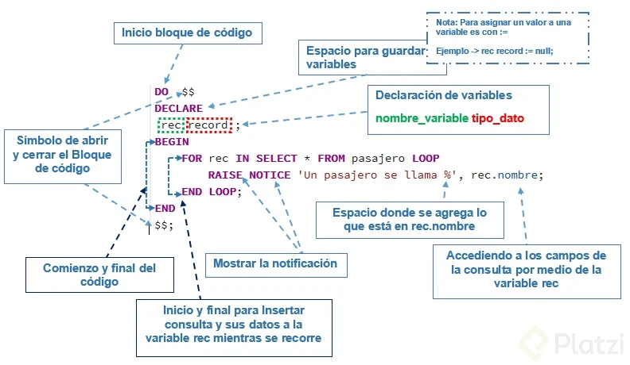

# Curso de PostgreSQL

## ¿Qué es Postgresql?

Es un sistema de gestión de bases de datos relacional orientado a objetos y de código abierto.

_Motor: Permite estructurar la información dentro de un servidor._
_Servidor: Un queripo el cual tiene una memoria y una ram para que funcione el motor de la base de datos._

PostgreSQL usa como objeto principal del núcleo el **Objeto-Relacional**, este se programa teniendo como referencia también la programación orientada a objetos por temas como la herencia y las interfaces.

Es muy conocida por los servicios que usa de PostGIS(corresponde a un servicio de geolocalización que permite hacer muchas funciones con respecto a mapas) y de Pl/PgSQL(permiten desarrollar funcionalidades de un backend directamente en PostgreSQL) que corresponden a los servicios de desarrollo de código interno de la base de datos.

PostgreSQL cumple con el esquema **_A.C.I.D_**

- **A: Atomicity – Atomicidad ->** Separar las funciones desarrolladas en la BD como pequeñas tareas y ejecutarlas como un todo. Si alguna tarea falla se hace un rollback(Se deshacen los cambios).
- **C: Consistency – Consistencia ->** Todo lo que se desarrolló en base al objeto relacional. Los datos tienen congruencia.
- **I: Isolation – Aislamiento ->** Varias tareas ejecutándose al mismo tiempo dentro de la BD.
- **D: Durability – Durabilidad ->** Puedes tener seguridad que la información no se perderá por un fallo catastrófico. -

PostgreSQL guarda la información en una Bitácora.

## Archivos de Configuración

A través de la sentencia SHOW CONFIG se nos muestra donde están los archivos de configuración.

- **Postgresql.conf:** Configuración general de postgres, múltiples opciones referentes a direcciones de conexión de entrada, memoria, cantidad de hilos de pocesamiento, replica, etc.

- **pg_hba.conf:** Muestra los roles así como los tipos de acceso a la base de datos.

- **pg_ident.conf:** Permite realizar el mapeo de usuarios. Permite definir roles a usuarios del sistema operativo donde se ejecuta postgres.

## Comandos más utilizados en PostgreSQL

### Comandos de ayuda

- **\?**: Con el cual podemos ver la lista de todos los comandos disponibles en consola, comandos que empiezan con backslash ().

- **\h**: Con este comando veremos la información de todas las consultas SQL disponibles en consola.

### Comandos de navegación y consulta de información

- **\c**: Saltar entre bases de datos.

- **\l**: Listar base de datos disponibles.

- **\dt**: Listar las tablas de la base de datos.

- **\d**: <nombre_tabla> Describir una tabla.

- **\dn**: Listar los esquemas de la base de datos actual.

- **\df**: Listar las funciones disponibles de la base de datos actual.

- **\dv**: Listar las vistas de la base de datos actual.

- **\du**: Listar los usuarios y sus roles de la base de datos actual.

- **\dG**: Listar los usuarios y sus roles de la base de datos actual.

### Comandos de inspección y ejecución

- **\g**: Volver a ejecutar el comando ejecutando justo antes.

- **\s**: Ver el historial de comandos ejecutados.

- **\s**: <nombre_archivo> Si se quiere guardar la lista de comandos ejecutados en un archivo de texto plano.

- **\i**: <nombre_archivo> Ejecutar los comandos desde un archivo.

- **\e**: Permite abrir un editor de texto plano, escribir comandos y ejecutar en lote. \e abre el editor de texto, escribir allí todos los comandos, luego guardar los cambios y cerrar, al cerrar se ejecutarán todos los comandos guardados.

- **\ef**: Equivalente al comando anterior pero permite editar también funciones en PostgreSQL.

### Comandos para debug y optimización

- **\timing**: Activar / Desactivar el contador de tiempo por consulta.

### Comandos para cerrar la consola

- **\q**: Cerrar la consola.

## Jerarquía de Bases de Datos

Toda jerarquía de base de datos se basa en los siguientes elementos:

- **Servidor de base de datos**: Computador que tiene un motor de base de datos instalado y en ejecución.

- **Motor de base de datos**: Software que provee un conjunto de servicios encargados de administrar una base de datos.

- **Base de datos**: Grupo de datos que pertenecen a un mismo contexto.

- **Esquemas de base de datos en PostgreSQL**: Grupo de objetos de base de datos que guarda relación entre sí (tablas, funciones, relaciones, secuencias).

- **Tablas de base de datos**: Estructura que organiza los datos en filas y columnas formando una matriz.

## Particiones

A veces cuando estamos manejando tablas con un numero grande de registros, varios millones o mas es necesario particionar las tablas para obtener un mejor desempeño a la hora de consultar dichas tablas. A este proceso se le suele denominar "Partitioning" y es le metodo usado para descomponer una enorme tabla (father) en un cojunto de tablas hijas (child).

Algunas de las enormes ventajas son:

    - Desempeño mejorado para la obtencion de registros (Querys).

    - Desempeño mejorado para la actualización (update).

    - Indices mas pequeños para cada tabla hija contra indices grandes y dificiles de colocar en memoria en una tabla grande.

    - Eliminación rapida de registros. Empleando DROP TABLE en vez de DELETE.

    - Los datos pueden ser migrados o respaldados en medios economicos y pequeños como DVDs, discos duros extraibles, etc.

En postgresql el tipo de partitioning soportado se denomina particionado mediante herencia de tablas. Cada partición puede ser creada como una tabla hija de una unica tabla padre. La tabla padre normalmente debe de ser una tabla vacia, que representara a todo el conjunto de datos.

Los dos tipos de particionado mas comunes en postgresql son:

1. Particionar por rangos. La tabla es particionada mediante rangos definidos en base a la columna de llave primary o cualquier columna que no se solape entre los rangos de valores asignados a diferentes tablas hijas.

2. Particionar por lista. La tabla es particionada listando los valores de cada una de las llaves en cada particion.

En postgresql para poder utilizar dicha técnica es necesario seguir algunos pasos:

1. Crear la tabla "maestra", de la cual todas las tablas hijas heredaran. Esta tabla no contendra datos, no debe de tener ningun tipo de restricción (check), no debe de tener indice ni nada por el estilo.

2. Crear todas las tablas hijas heredando de la tabla maestra. Por lo regular estas tablas heredaran todos los campos de la tabla padre y no es necesario crearlos nosotros mismos.

3. Agregar a todas las tablas hijas las restricciones correspondientes sobre los datos que albergaran. Algunos ejemplos de esto serian: CHECK ( pais IN ('México', 'Argentina')), CHECK ( id_cliente BETWEEN 100 AND 200 ) ... CHECK ( id_cliente BETWEEN 5000 AND 5200), en estos dos ultimos ejemplos para evitar traslapes entre los ids de clientes.

4. Para cada particion, crear un indice para la columna(s) llave, tambien se pueden poner los indices que a cada quien le convengan. El indice para la llave primaria no es estrictamente necesario, pero en la mayoria de los casos ayuda mucho. Si tu necesitas una llave unica o llave primaria, necesitaras crearla para cada tabla hija.

5. Definir una regla (RULE) o trigger para redirigir las modificaciones de la tabla padre (master) a la apropiada particion.

6. Verificar que este habilitado a on el parametro constraint_exlusion (SET constraint_exclusion = on;) en el archivo de configuracion postgresql.conf para que los querys sean optimizados para el partitioning.

```sql
-- EJEMPLO

CREATE TABLE <nombre_de_la_partición> PARTITION OF <nombre_de_la_tabla_padre>
FOR VALUES FROM (<rango inicial>) TO (<ranog final>)

```

## Roles

### Var caracteristicar de toles

```SQL
\h CREATE ROl

```

### Crear roles

```SQL
CREATE ROLE <nombre_de_usuario> WITH <caracteristicas>;

CREATE ROLE usuario_consulta WITH LOGIN;
```

**_CREATE ROLE === CREATE USUARIO_**

## Funciones Especiales

Existen 4 funciones especiales que nos ayudarán en nuestro día a día estas son

- ON CONFLICT DO: Es una especie de sobre escritura sobre algo que ya este creado “Como un UPDATE”

- RETURNING: Muestra en pantalla el último cambio hecho

- LIKE / ILIKE: Busqueda por similitudes la diferencia entre ambas es que like busca en minusculas y ilike busca mayusculas/minisculas

- IS / IS NOT: comparacion para atributos especiales como el NULL

```sql
--ON CONCLICT  DO
SELECT * FROM estacion;

-- ON CONFLICT DO NOTHING
--Sí el registro existe, no hace nada pero sí  el registro  no existe lo crea
INSERT INTO public.estacion (id,nombre,direccion)
VALUES (350,'xxx','xxx')
ON CONFLICT DO NOTHING;

SELECT * FROM estacion;

-- ON CONFLICT DO UPDATE SET
--Sí el registro existe lo actuliza, sí no existe lo crea
INSERT INTO public.estacion (id,nombre,direccion)
VALUES (350,'xxx','xxx')
ON CONFLICT (id) DO
	UPDATE SET id = 102 ,nombre = 'San francisco ',direccion = '46 howlang';

SELECT * FROM estacion;


--RETUNING
-- RETURNING * | RETURNING name_column
--Una vez insertamos el valor este no los devuelve muy útil para no usar un SELECT.
INSERT INTO public.estacion (nombre,direccion)
VALUES ('New York Station',' 49 Muir Way')
RETURNING *


--IS/IS NOT
--IS/IS NOT, nos permite comparar tipos de datos que no son estándar o son objetos.
--NULL es un tipo de dato NO ESTÁNDAR
SELECT * FROM public.estacion
WHERE estacion IS NOT NULL;
```

## Funciones Especiales Avanzadas

Funciones Especiales avanzadas en PosgreSQL

- **COALES**: compara dos valores y retorna el que es nulo.
- **NULLIF**: Retorna null si son iguales.
- **GREATEST**: Compara un arreglo y retorna el mayor.
- **LEAST**: Compara un arreglo de valores y retorna el menor.
- **BLOQUES ANONIMOS**: Ingresa condicionales dentro de una consulta de BD.

## Las Vistas

Las vistas en esencia son agarra runa consulta que se repite mucho y asignarle un nombre para llamar directa mente.

Existen dos tipos de vistas:

- **Vistas Volátiles**: Siempre que se haga la consulta en la vista, la BD hace la ejecución de la consulta en la BD, por lo que siempre se va a tener información reciente.

- **Vistas Materializada-Persistente**: Hace la consulta una sola vez, y la información queda almacenada en memoria, la siguiente vez que se consulte, trae el dato almacenado, eso es bueno y malo a la vez, bueno porque la velocidad con la se entrega la información es rápida, malo porque la información es actualizada. Es ideal utilizar este tipo de vistas en consultas preexistentes y que no cambien, por ejemplo, las ventas del dio de ayer.

## PL/SQL



```sql
DO $$
DECLARE
	rec record := NULL;
	contador integer := 0;
BEGIN
	FOR rec IN SELECT * FROM pasajeros LOOP
		RAISE NOTICE 'El pasejro se llama %', rec.nombre;
		contador := contador + 1;
	END LOOP;
	RAISE NOTICE 'Conteo -> %', contador;
END
$$
```

```sql
CREATE FUNCTION impl()
	RETURNS integer
	LANGUAGE 'plpgsql'
AS $$
DECLARE
	rec record := NULL;
	contador integer := 0;
BEGIN
	FOR rec IN SELECT * FROM pasajeros LOOP
		contador := contador + 1;
	END LOOP;
	INSERT INTO conteo_pasajeros (total, tiempo)
		VALUES (contador, now());
	RETURN contador;
END
$$
```

## Triggers

Son métodos los cuales nos emiten ejecutar funcionalidades cuando se realicen acciones en una tabla (INSERT, UPSATE, DELETE)

```sql
CREATE FUNCTION impl()
	RETURNS TRIGGER
	LANGUAGE 'plpgsql'
AS $$
DECLARE
	rec record := NULL;
	contador integer := 0;
BEGIN
	FOR rec IN SELECT * FROM pasajeros LOOP
		contador := contador + 1;
	END LOOP;
	INSERT INTO conteo_pasajeros (total, tiempo)
		VALUES (contador, now());
	RETURN NEW;
	-- NEW para confirmar los cambios
	-- OLD para debolver la tabla sin cambios
END
$$
```

```sql
CREATE TRIGGER mitrigger
AFTER  INSERT ON pasajeros
FOR EACH ROW EXECUTE PROCEDURE impl();
```

## Conectando a Servidores Remotos

```sql
CREATE EXTENSION dblink;

SELECT * FROM
dblink('dbname=<nombre>
		port=<puerto>
		host=<host>
		user=<usuario>
		password=<password>',
		'SELECT * FROM <nombre_tabla>')
		AS datos_remotos(<foramto de los datos>);

-- ############
SELECT * FROM
dblink('dbname=remota
		port=5432
		host=127.0.0.1
		user=usuario_consulta
		password=etc123',
		'SELECT * FROM usuarios_vip')
		AS datos_remotos(id integer, fecha date);

SELECT * FROM pasajeros
JOIN
dblink('dbname=remota
		port=5432
		host=127.0.0.1
		user=usuario_consulta
		password=etc123',
		'SELECT * FROM usuarios_vip')
		AS datos_remotos(id integer, fecha date)
USING (id);
```

## Transacciones

Las transacciones, tienen la capacidad para empaquetar varios pasos en una sola operación “todo o nada”.y si ocurre alguna falla que impida que se complete la transacción, entonces ninguno de los pasos se ejecuta y no se afecta la base de datos en absoluto.

### SQL Transacción - Estructura

La transacciones tienen la siguiente estructura postgres. Postgres en las operaciones normales usa de manera implícita el rollback el rollback.

- **BEGIN**: Inicia el motor de base de datos, diciéndole que tenemos que hacer lo siguiente en una sola transacción.
- **COMMIT**: Si llegamos al final guarde todo el cambio.
- **ROLLBACK**: Si ocurre un error devuelva todo lo que hicimos.

```sql
BEGIN;
<Consultas>
COMMIT|ROLLBACK

-- ####################

BEGIN;
INSERT INTO public.estaciones(
	direccion, nombre)
	VALUES ('direcccc', 'Estacion Transac');

INSERT INTO public.trenes(
	capacidad, modelo)
	VALUES (300, 'Modelo Transac');

COMMIT;
```

## Extensiones

[Extensiones](https://www.postgresql.org/docs/13/contrib.html)

```sql
CREATE EXTENsION fuzzystrmatch;

SELECT levenshtein('Mauro', 'Mauricio');

SELECT difference('beard', 'bird');
```

## Mantenimiento

Postgres maneja una serie de funciones que trabajan en segundo plano mientras que trabajamos directamente en la base de datos, y esto es a lo que le llamamos mantenimiento.

El nombre más común de esto es Vaccum, ya que esto quita todas las filas y columnas e items del disco duro que no están funcionando, ya que postgres al percatarse de esto, las marca como “para borrar después”.

- Vacuum: La más importante, con tres opciones, Vacuum, Freeze y Analyze.
  - Full: la tabla quedará limpia en su totalidad.
  - Freeze: durante el proceso la tabla se congela y no permite modificaciones hasta que no termina la limpieza.
  - Analyze: solo revisa la tabla.
- Analyze: No hace cambios en la tabla. Solo hace una revisión y la muestra.
- Reindex: Aplica para tablas con numerosos registros con indices, como por ejemplo las llaves primarias.
- Cluster: Especificamos al motor de base de datos que reorganice la información en el disco.

## Replicas

Para aplicar las replicas a nuestra base de datos necesitamos más de un servidor corriendo un nodo de PostgreSQL.
Tenemos que modificar loas archivos de configuración de ambas bases de datos:

### Master

#### Archivo - Postgresql.conf

    # Este indica que la db va a funcionar en stanby, s decir que va a guardar sus archivos de bitácora hasta que algún esclavo los copie y ejecute.
    wal_level = hot_standby

    #Número máximo de replicadores
    max_wal_senders = 2

    # <indica como vamos a guardar los archivos de la bitácora, esto indica que dichos archivos no lo vamos a eliminar si no a archivar
    archive_mode = on
    archive_command = ‘cp %p /tmp/%f’

#### Archivo - pg_hba.conf

    # Para evitar que la db de replicas tenga que autenticarse debemos agregar su ip a la lista de host permitidos
    host	replication 	all 	xxx.x.x.xx/32 	trust

**_Reiniciamos el servicio de PostgreSQL en master. _**

### Esclavo

#### Archivo - Atravez de la consola

    # Tenemos que indicarle que copie toda la información de master para que inicie su información con lo hay ya en master
    sudo service postgresql stop
    rm -rf  /var/lib/pgsql/data/*
    pg_basebackup  –U  <USUARIO>   -R   -D  /var/lib/pgsql/data/   --host=xxx.xx.xx.x   --port=5432

#### Archivo - Postgresql.conf

    # se inicie en modo replica
    wal_level = hot_standby

**_Reiniciamos el servicio de PostgreSQL en esclavo. _**
