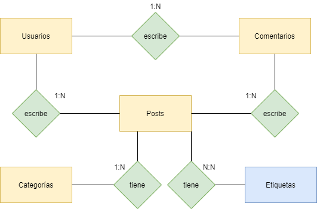

# Platziblog

## Entidades

- **Post**

  - Titulo
  - Fecha de publicación
  - Contenido
  - Estatus
  - Etiquetas (multivaluado)
  - IdPost
  - IdUsuario (clave foránea)
  - IdCategoria (clave foránea)

- **Usuarios**

  - Login
  - password
  - Nickname
  - Email
  - IdUsuario

- **Comentarios**

  - Contenido
  - IdComentario
  - IdUsuario (clave foránea)
  - IdPosts (clave foránea)

- **Categorías**

  - Nombre de Categoría
  - IdCategoria

- **Etiquetas**

  - Nombre de Etiqueta
  - IdEtiqueta

- **Posts Etiquetas (tabla Pivote)**
  - IdPost (clave primaria, clave foránea)
  - IdEtiqueta (clave foránea)

## Diagrama ER

## Diagrama Fisico

