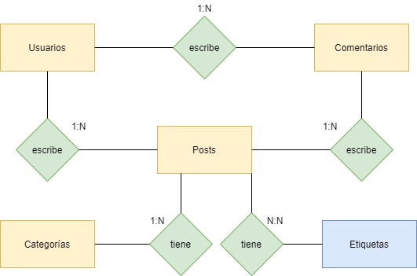
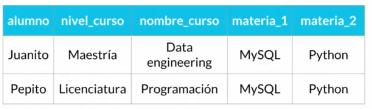
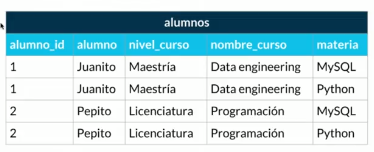
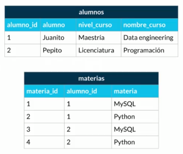
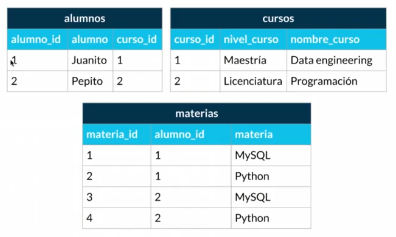
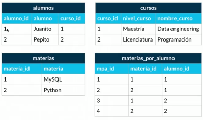

# Fundamentos de Bases de Datos

## Bases de datos relacionales

Una base de datos relacional es un tipo de base de datos que almacena y proporciona acceso a puntos de datos relacionados entre sí. Las bases de datos relacionales se basan en el modelo relacional, una forma intuitiva y directa de representar datos en tablas.

#### Ejemplos de bases de datos relacionales:

- SQLServer
- MySQL
- PostgresSQL
- MariaDB
- ORACLE

## Bases de datos no relacionales

Las bases de datos relacionales se basan en la organización de la información en partes pequeñas que se integran mediante identificadores; a diferencia de las bases de datos no relacionales que, como su nombre lo indica, no tienen un identificador que sirva para relacionar dos o más conjuntos de datos.

En este tipo, la información se representa mediante objetos, de la misma forma que son representados en los lenguajes de programación orientada a objetos (POO) como ocurre en JAVA, C# o Visual Basic . NET.

#### Ejemplos de bases de datos no relacionales:

- Memcached
- cassandre
- elasticsearch
- dynamodb
- neo4j
- mongodb
- firestore

## Servicios de Bases de Datos

- **Auto administrados:** Los auto administrado es la base de datos que tu instalas en tu computadora o en tu servidor, tu te encargas de actualizarla y del mantenimiento.

- **Administrados:** Los servicios administrados no los llevas tú, estos son servicios que ofrecen las nubes modernas, la puedes usar, pero no tienes que encargarte de todo el mantenimiento e la misma.

# Introducción a las bases de datos relacionales

## Historia de las RDB - (bases de datos relacionales)

Las bases de datos surgen de la necesidad de conservar la información más allá de lo que existe en la memoria RAM.

Las bases de datos basadas en archivos eran datos guardados en texto plano, fáciles de guardas pero muy difíciles de consultar y por la necesidad de mejorar esto nacen las bases de datos relacionales. Su invertir **Edgar Codd** dejó ciertas reglas para asegurarse de que toda la filosofía de las bases de datos no se pierda, estandarizo el proceso.

## 12 reglas de Codd

Codd se percató de que existían bases de datos en el mercado las cuales decían ser relacionales, pero lo único que hacían era guardar la información en las tablas, sin estar estas tablas literalmente normalizadas; entonces éste publicó 12 reglas que un verdadero sistema relacional debería tener aunque en la práctica algunas de ellas son difíciles de realizar. Un sistema podrá considerarse “más relacional” cuanto más siga estas reglas.

- **Regla 0**: el sistema debe ser relacional, base de datos y administrador de sistema. Ese sistema debe utilizar sus facilidades relacionales (exclusivamente) para manejar la base de datos.

- **Regla 1:** la regla de la información, toda la información en la base de datos es representada unidireccionalmente, por valores en posiciones de las columnas dentro de filas de tablas. Toda la información en una base de datos relacional se representa explícitamente en el nivel lógico exactamente de una manera: con valores en tablas.

- **Regla 2:** la regla del acceso garantizado, todos los datos deben ser accesibles sin ambigüedad. Esta regla es esencialmente una nueva exposición del requisito fundamental para las llaves primarias. Dice que cada valor escalar individual en la base de datos debe ser lógicamente direccionable especificando el nombre de la tabla, la columna que lo contiene y la llave primaria.

- **Regla 3:** tratamiento sistemático de valores nulos, el sistema de gestión de base de datos debe permitir que haya campos nulos. Debe tener una representación de la “información que falta y de la información inaplicable” que es sistemática, distinto de todos los valores regulares.

- **Regla 4:** catálogo dinámico en línea basado en el modelo relacional, el sistema debe soportar un catálogo en línea, el catálogo relacional debe ser accesible a los usuarios autorizados. Es decir, los usuarios deben poder tener acceso a la estructura de la base de datos (catálogo).

- **Regla 5:** la regla comprensiva del sublenguaje de los datos, el sistema debe soportar por lo menos un lenguaje relacional que:

  - Tenga una sintaxis lineal.
  - Puede ser utilizado de manera interactiva.
  - Soporte operaciones de definición de datos, operaciones de manipulación de datos (actualización así como la recuperación), seguridad e integridad y operaciones de administración de transacciones.

- **Regla 6:** regla de actualización, todas las vistas que son teóricamente actualizables deben ser actualizables por el sistema.

- **Regla 7:** alto nivel de inserción, actualización, y cancelación, el sistema debe soportar suministrar datos en el mismo tiempo que se inserte, actualiza o esté borrando. Esto significa que los datos se pueden recuperar de una base de datos relacional en los sistemas construidos de datos de filas múltiples y/o de tablas múltiples.

- **Regla 8:** independencia física de los datos, los programas de aplicación y actividades del terminal permanecen inalterados a nivel lógico cuandoquiera que se realicen cambios en las representaciones de almacenamiento o métodos de acceso.

- **Regla 9:** independencia lógica de los datos, los cambios al nivel lógico (tablas, columnas, filas, etc.) no deben requerir un cambio a una solicitud basada en la estructura. La independencia de datos lógica es más difícil de lograr que la independencia física de datos.

- **Regla 10:** independencia de la integridad, las limitaciones de la integridad se deben especificar por separado de los programas de la aplicación y se almacenan en la base de datos. Debe ser posible cambiar esas limitaciones sin afectar innecesariamente las aplicaciones existentes.

- **Regla 11:** independencia de la distribución, la distribución de las porciones de la base de datos a las varias localizaciones debe ser invisible a los usuarios de la base de datos. Los usos existentes deben continuar funcionando con éxito:

  - Cuando una versión distribuida del SGBD se introdujo por primera vez.
  - Cuando se distribuyen los datos existentes se redistribuyen en todo el sistema.

- **Regla 12:** la regla de la no subversión, si el sistema proporciona una interfaz de bajo nivel de registro, a parte de una interfaz relacional, que esa interfaz de bajo nivel no se pueda utilizar para subvertir el sistema, por ejemplo: sin pasar por seguridad relacional o limitación de integridad. Esto es debido a que existen sistemas anteriormente no relacionales que añadieron una interfaz relacional, pero con la interfaz nativa existe la posibilidad de trabajar no relacionalmente.

## Entidades y Atributos

Una entidad es algo muy similar a un objeto(POO) y representa algo en el mundo real, incluso algo abstracto. Tienen atributos que son las cosas que los hacen ser una entidad y por convención se ponen en plural.

- **Los atributos compuestos:** son aquellos que tienen atributos en ellos mismos.
- **Los atributos llaves:** son aquellos que identifican a la entidad y no pueden ser repetidos. Existen

  - _Naturales:_ son inherentes al objeto como el número de serie.
  - _Claves artificiales:_ no es inherente al objeto y se asigna de manera arbitraria.

- **Entidades fuertes:** son entidades que pueden sobrevivir por sí solas.
- **Entidades débiles:** No pueden existir sin una entidad fuerte y se representan con un cuadrado con doble línea.
  - _Identidades débiles por identidad:_ no se diferencia entre si mas que la clave de su identidad fuerte.
  - _Identidades débiles pro existencia:_ se les asigna una clave propia.

Ejemplo --> libros(entidad fuerte) - ejemplares(entidad debil)

## Relaciones

Las **relaciones** nos permiten ligar o unir nuestras diferentes entidades y se representan con rombos. Por convención se define a través de verbos.

Las relaciones tienen una propiedad llamada **cardinalidad** y tiene que ver con números. Cuántos de un lado pertenecen a cuántos del otro lado:

- Cardinalidad: 1 a 1
- Cardinalidad: 0 a 1
- Cardinalidad: 1 a N
- Cardinalidad: 0 a N
- Cardinalidad: N a N

## Diagrama ER

Un diagrama es como un mapa y nos ayuda a entender cuáles son las entidades con las que vamos a trabaajar, cuáles son sus relaciones y qúe papel van a jugar en las aplicaciones de la base de datos.

## Tipos de Datos

- **Texto:**

  - CHAR(n): es un tipo de dato que te permite almacenar cadenas de caracteres.
  - VARCHAR(n): es un tipo de dato que te permite almacenar cadenas de caracteres(limite 255 caracteres).
  - TEXT: es un tipo de dato que te permite almacenar texttos grandes.

_Cuando surgieron las bases de datos tratan de optimizar e uso de memoria, la diferencia entre VARCHAR y CHAR, es que CHAR lo que hacia era tomar un pedacito de memoria del numero de caracteres que vas a guardar y reservarlo para que solo tú lo puedas ocupar (si se le asigna un espacio de 8 caracteres siempre van a ser 8 caracteres), VARCHAR sin embargo hace esto de manera dinámica reservaba un mínimo de espacio en memoria y a partir de ahí iba creciendo o encogiéndose hasta el máximo que declararas para permitir que guardaras cadenas mas grandes o mas chicas._

- **Números:**

  - INTEGER: Numeros enteros.
  - BIGINT: Es un subtipo de INTEGER, este nos permite almacenar un números muy grande.
  - SMALLINT: Es un subtipo de INTEGER, este nos permite almacenar un números mas pequeños(99 o menos).
  - DECIMAL(n,s): Recibe dos parámetros de entrada, que representan los números, lo primeros que añades es la parte entera y lo segundo es la parte decimal.
  - NUMERIC(n,s): Recibe dos parámetros de entrada, que representan los números, lo primeros que añades es la parte entera y lo segundo es la parte decimal.

- **Fecha/hora:**

  - DATE: Fecha(año mes y dia).
  - TIME: Hora.
  - DATETIME: Guarda la fecha y la hora.
  - TIMESTAMP: Guarda la fecha y la hora.

- **Lógicos:**

  - BOOLEAN: Verdadero o falso.

### Constraints(Restricciones)

- NOT NULL: Se asegura que la columna no tenga valores nulos.
- UNIQUE: Se asegura que cada valor en la columna no se repita.
- PRIMARY KEY: Es una combinación de _NOT NULL_ y _UNIQUE_.
- FOREIGN KEY: Identifica de manera única una tupla en otra tabla.
- CHECK: Se asegura que el valor en la columna cumpla una condición dada.
- DEFAULT: Coloca un valor por defecto cuando no hay un valor especificado.
- INDEX: Se crea pro columna para permitir búsquedas más rápidas.

### Normalización

[Ejemplo Completo](https://docs.google.com/document/d/1cA1rNSk-tJgX3brjufMvpx-gqcvvkaylxyKi8Fke_ag/edit?usp=sharing)

La normalización como su nombre lo indiaca nos ayuda a dejar todo de una forma normal. Esto obedece a las [12 reglas de Codd](12-reglas-de-Codd) y nos permiten separar componentes en la base de datos:

- **Primera forma normal(1FN):** Atributos atómicos (Sin campos repetidos).

- **Segunda forma normal(2FN):** Cumple con **1FN** y cada campo de la tabla debe depender de una clave única.

- **Tercera forma normal(3FN):** Cumple con **1FN** y **2FN** y los campos que **NO** son clave, **NO** deben de tenar dependencias.

- **Cuarta forma normal(4FN):** Cumple con **1FN** y **2FN** y **3FN** y los campos multivaluados se identifican por una clave única.

# SQL

## Historia de SQL

**SQL** significa **Structured Query Language** y tiene una estructura clara y fija. Su objetivo es hacer un solo lenguaje para consultar cualquier manejador de bases de datos volviéndose un gran estándar.

Ahora existe el **NOSQL** o **Not Only Structured Query language** que significa que no sólo se utiliza **SQL** en las bases de datos no relacionales.

## DDL

**SQL** tiene dos grandes sublenguajes:

- **DDL (Data Definition Language)**

Este nos ayuda a crear la estructura de una base de datos.

Esxiten tres grandes comados:

- Create: Nos ayuda a crear bases de datos, tablas, vistas, índices, etc.
- Alter: Ayuda a alterar o modificar entidades.
- Drop: Nos ayuda a borrar. _Hay que tener cuidado al utilizarlo._

**3 Objetos que manipularemos con el lenguaje DDL:**

- Database o bases de datos.
- Table o tablas: Son traducción a SQL de las entidades.
- View o vistas: Se ofrece la proyección de los datos de las bases de datos de forma entendible.

# Consultas a una base de datos

Las consultas en una base de datos juegan un papel muy fundamental, puesto que facilitan de manera considerable los procesos en cualquier empresa.

Alrededor de las consultas de las bases e datos se han creado varias especialidades como **ETL** o transformación de datos. **Business intelligence** e incluso **machine learning**.

## Estructura básica de las queries

Las queries son la forma en la que estructuramos las preguntas que se harán a la base de datos transforma preguntas en sintaxis.

El query tiene básicamente 2 partes: **SELECT** y **FROM** y puede aparecer una tercera como **WHERE**.
